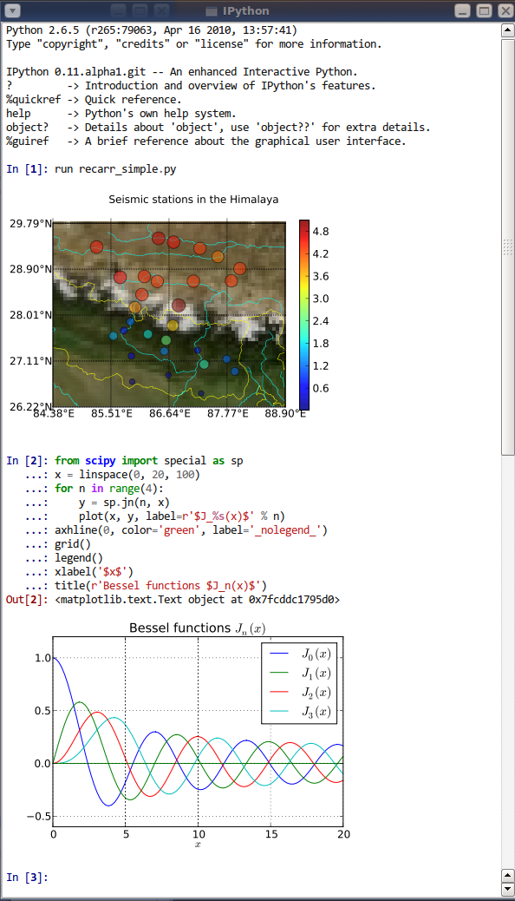

# Jupyter Qt Console

A rich Qt-based console for working with Jupyter kernels,
supporting rich media output, session export, and more.

The Qt console is a very lightweight application that largely feels like a terminal, but
provides a number of enhancements only possible in a GUI, such as inline
figures, proper multiline editing with syntax highlighting, graphical calltips,
and more.

## Install Qt console
The Qt console requires Qt, such as [PyQt5](http://www.riverbankcomputing.com/software/pyqt/intro),
[PyQt4](https://www.riverbankcomputing.com/software/pyqt/download),
or [PySide](http://pyside.github.io/docs/pyside).

Although [pip](https://pypi.python.org/pypi/pip) and
[conda](http://conda.pydata.org/docs) may be used to install the Qt console, conda
is simpler to use since it automatically installs PyQt. Alternatively,
the Qt console installation with pip needs additional steps since pip cannot install
the Qt requirement.

### Install using conda
To install:

    conda install qtconsole

**Note:** If the Qt console is installed using conda, it will **automatically**
install the Qt requirement as well.

### Install using pip
To install:

    pip install qtconsole

**Note:** Make sure that Qt is installed. The next section gives instructions on installing Qt.

### Installing Qt (if needed)
We recommend installing PyQt with [conda](http://conda.pydata.org/docs):

    conda install pyqt

or with a system package manager. For Windows, PyQt binary packages may be
used:

    pip install pyqt5

**Note:** Additional information about using a system package manager may be
found in the [qtconsole documentation](https://qtconsole.readthedocs.io). For
example, on Linux Debian/Ubuntu, use ``sudo apt-get install python3-pyqt5`` to
install PyQt5, ``sudo apt-get install python-qt4`` or
``sudo apt-get install python3-pyqt4`` to install PyQt4.

## Usage
To run the Qt console:

    jupyter qtconsole

## Resources
- [Project Jupyter website](https://jupyter.org)
- Documentation for the Qt console
  * [latest version](https://qtconsole.readthedocs.io/en/latest/) [[PDF](https://media.readthedocs.org/pdf/qtconsole/latest/qtconsole.pdf)]
  * [stable version](https://qtconsole.readthedocs.io/en/stable/) [[PDF](https://media.readthedocs.org/pdf/qtconsole/stable/qtconsole.pdf)]
- [Documentation for Project Jupyter](https://jupyter.readthedocs.io/en/latest/index.html) [[PDF](https://media.readthedocs.org/pdf/jupyter/latest/jupyter.pdf)]
- [Issues](https://github.com/jupyter/qtconsole/issues)
- [Technical support - Jupyter Google Group](https://groups.google.com/forum/#!forum/jupyter)
